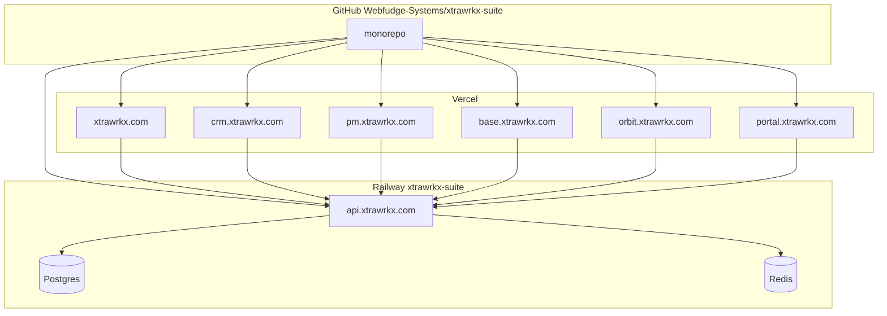
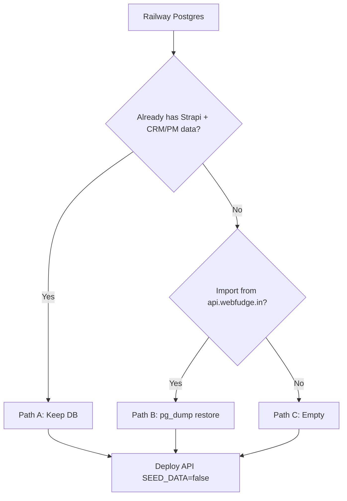

# Webfudge Systems — Complete Deployment Guide

## Summary

End-to-end checklist for the **Xtrawrkx Suite** monorepo:

| Platform | Resource | Role |
|----------|----------|------|
| **GitHub** | [Webfudge-Systems/xtrawrkx-suite](https://github.com/Webfudge-Systems/xtrawrkx-suite) | Source of truth |
| **Railway** | Project **`xtrawrkx-suite`** | Strapi API, Postgres, Redis |
| **Vercel** | Team **Webfudge Systems** | Next.js frontends |

Production domains use **`*.xtrawrkx.com`**. Env templates live in each app as `.env.example` (committed), `.env.local` (dev), and `.env.production` (secrets — **gitignored**).

**Env reference:** [ENV_FILES.md](./ENV_FILES.md)

---

## Production URLs (canonical)

| App | Domain | Repo path | Vercel root |
|-----|--------|-----------|-------------|
| Landing | `https://xtrawrkx.com` | `apps/landing` | `apps/landing` |
| CRM | `https://crm.xtrawrkx.com` | `apps/crm` | `apps/crm` |
| PM | `https://pm.xtrawrkx.com` | `apps/pm` | `apps/pm` |
| Accounts | `https://base.xtrawrkx.com` | `apps/accounts` | `apps/accounts` |
| Orbit | `https://orbit.xtrawrkx.com` | `apps/organization-manager` | `apps/organization-manager` |
| Client portal | `https://portal.xtrawrkx.com` | `apps/xtrawrkx-client-portal` | `apps/xtrawrkx-client-portal` |
| API | `https://api.xtrawrkx.com` | `apps/backend` | Railway only |
| Books (optional) | TBD | `apps/books` | `apps/books` |

| Dev port | App |
|----------|-----|
| 3000 | Landing |
| 3001 | CRM |
| 3002 | Client portal |
| 3003 | Accounts |
| 3004 | Orbit |
| 3005 | PM |
| 3008 | Books |
| 1337 | Strapi API |

---

## Architecture



---

## Environment files (before deploy)

Each app has three files — see [ENV_FILES.md](./ENV_FILES.md).

| File | Git | Use |
|------|-----|-----|
| `.env.example` | Committed | Structure + placeholder secrets |
| `.env.local` | Ignored | Local dev (`localhost` URLs) |
| `.env.production` | Ignored | **Copy values into Railway / Vercel** |

### Quick setup (local)

```bash
# Next.js apps — dev
cp apps/crm/.env.example apps/crm/.env.local
# … repeat per app, or use existing .env.local files

# Strapi — must use .env (not .env.local alone)
cp apps/backend/.env.local apps/backend/.env
```

### Production copy workflow

1. Open `apps/<app>/.env.production` on your machine (gitignored).
2. **Railway (API):** paste `apps/backend/.env.production` into service **`xtrawrkx_suits`** → Variables. Fill `DATABASE_URL` and `REDIS_URL` from Railway dashboards (below).
3. **Vercel (each frontend):** Project → Settings → Environment Variables → **Production** → paste matching app’s `.env.production`.
4. **Redeploy** every service after env changes (`NEXT_PUBLIC_*` is baked in at build time on Vercel).

### Backend — paste from Railway dashboards

**Postgres service → Variables** (use on API service via reference or copy):

| Railway key | Maps to API env |
|-------------|-----------------|
| `DATABASE_PRIVATE_URL` | `DATABASE_URL` (preferred in same project) |
| `DATABASE_URL` | Public URL (fallback) |

**Redis service → Variables** (link Redis to API, then reference):

| Railway key | Maps to API env |
|-------------|-----------------|
| `REDIS_URL` | `REDIS_URL` (private, `redis.railway.internal`) |
| `REDISHOST` + `REDISPORT` + `REDISUSER` + `REDISPASSWORD` | Fallback if URL not set |

In Railway UI: API service → Variables → **Add variable reference** from Postgres / Redis services instead of pasting public URLs when possible.

### Landing — extra secrets

From `apps/landing/.env.production` (also in `.env.example` as placeholders):

- Cloudinary: `NEXT_PUBLIC_CLOUDINARY_*`, `CLOUDINARY_API_SECRET`
- Firebase: `NEXT_PUBLIC_FIREBASE_*`
- Contact form: `EMAIL_USER`, `EMAIL_PASS` — [LANDING_CONTACT_FORM.md](./LANDING_CONTACT_FORM.md)

---

## Master checklist

| # | Phase | Done |
|---|--------|------|
| 0 | [Env files](#environment-files-before-deploy) ready | ☐ |
| 1 | [GitHub](#phase-1--github) | ☐ |
| 2 | [Railway API](#phase-2--railway) | ☐ |
| 3 | [Postgres data](#phase-3--postgresql) — Path A / B / C | ☐ |
| 4 | [Redis](#phase-4--redis) | ☐ |
| 5 | [Backend verify](#phase-5--backend) | ☐ |
| 6 | [Vercel](#phase-6--vercel) | ☐ |
| 7 | [DNS + CORS](#phase-7--dns-and-cors) | ☐ |
| 8 | [Smoke tests](#phase-8--verification) | ☐ |

---

## Phase 1 — GitHub

**Canonical remote:**

```text
https://github.com/Webfudge-Systems/xtrawrkx-suite.git
```

### Push / update

```bash
git remote -v
# origin → Webfudge-Systems/xtrawrkx-suite

git add -A
git commit -m "your message"
git push origin master
```

Use one production branch (`master` or `main`) for both Railway and Vercel.

### Do not commit

- `.env`, `.env.local`, `.env.production`
- `apps/backend/.tmp/`, uploads with PII

---

## Phase 2 — Railway

Project **`xtrawrkx-suite`** · Service **`xtrawrkx_suits`** (API).

### 2.1 Source

| Setting | Value |
|---------|--------|
| Repository | `Webfudge-Systems/xtrawrkx-suite` |
| Branch | `master` (or `main`) |
| **Root Directory** | **`apps/backend`** |
| **Config-as-code file** | **`/apps/backend/railway.json`** (absolute from repo root) |

If deploy fails at **Snapshot** with `service config at 'railway.json' not found`, set **Config-as-code file** to **`/apps/backend/railway.json`** (not bare `railway.json`). Railway does not resolve a bare path relative to Root Directory.

Repo files: `apps/backend/railway.json` (canonical) and root `railway.json` (fallback if the dashboard path is still `railway.json`). Prefer updating the dashboard path and keeping both files in sync.

### 2.2 Build

| Setting | Value |
|---------|--------|
| Build | `npm install && npm run build` (from `railway.json`) |
| Start | `npm run start` |
| Node | 20.x |

### 2.3 Variables (copy from `apps/backend/.env.production`)

Minimum set:

```bash
NODE_ENV=production
HOST=0.0.0.0
PORT=${{PORT}}
PUBLIC_URL=https://api.xtrawrkx.com

DATABASE_CLIENT=postgres
DATABASE_URL=${{Postgres.DATABASE_PRIVATE_URL}}
DATABASE_SSL=true
DATABASE_SSL_REJECT_UNAUTHORIZED=false
DATABASE_POOL_MIN=0
DATABASE_POOL_MAX=5
SEED_DATA=false

REDIS_URL=${{Redis.REDIS_URL}}
REDIS_ENABLED=true
CACHE_API_ENABLED=true

APP_KEYS=<from .env.production — keep if Postgres already has data>
ADMIN_JWT_SECRET=<from .env.production>
API_TOKEN_SALT=<from .env.production>
TRANSFER_TOKEN_SALT=<from .env.production>
JWT_SECRET=<from .env.production>
ENCRYPTION_KEY=<from .env.production>

PLATFORM_ADMIN_EMAIL=admin@xtrawrkx.com
PLATFORM_ADMIN_RESET_PASSWORD=false
```

**If Postgres already has CRM/PM data:** do **not** rotate `APP_KEYS` / `JWT_*` unless you accept forcing all users to log in again.

Optional app URL hints for emails/links:

```bash
LANDING_APP_URL=https://xtrawrkx.com
CRM_APP_URL=https://crm.xtrawrkx.com
PM_APP_URL=https://pm.xtrawrkx.com
ACCOUNTS_APP_URL=https://base.xtrawrkx.com
```

Troubleshooting: [RAILWAY_STRAPI_DEPLOY.md](./RAILWAY_STRAPI_DEPLOY.md)

---

## Phase 3 — PostgreSQL



### Path A — Keep existing Railway Postgres ⭐

**Your case if `xtrawrkx-suite` Postgres already has tenant data.**

| Do | Don't |
|----|--------|
| Redeploy API with `SEED_DATA=false` | `pg_restore` / wipe volume |
| Keep same Strapi secrets as last writer to this DB | `SEED_DATA=true` on boot |
| Link `DATABASE_PRIVATE_URL` | New empty Postgres service |

After redeploy: `curl https://api.xtrawrkx.com/api/apps` · Strapi Admin · sample leads/tasks.

#### Healthcheck fails: `cannot drop table xtrawrkx_users`

Build/deploy succeed but **Network → Healthcheck** fails with **service unavailable**. Strapi crashes during schema sync because PostgreSQL blocks dropping legacy **`xtrawrkx_users`** while FKs still reference it. **Keep team data:** migrate `xtrawrkx_users` → **`up_users`**, then drop the legacy table (not a blind DROP).

1. Stop API service.
2. Run [RAILWAY_POSTGRES_XTRAWRKX_USERS_FIX.md](./RAILWAY_POSTGRES_XTRAWRKX_USERS_FIX.md) — `npm run migrate:legacy-users` in `apps/backend` with Railway `DATABASE_URL` (dry-run first).
3. Redeploy API.

### Path B — Import from legacy `api.webfudge.in`

1. Scale API to **0**.
2. `pg_dump` old Postgres → `pg_restore` into Railway `DATABASE_URL`.
3. Copy `public/uploads` from old API.
4. Use **same** Strapi secrets as old API.
5. Deploy with `SEED_DATA=false`.

### Path C — Empty

Fresh Postgres; bootstrap creates apps/modules only when empty; create orgs via Orbit/Admin.

| Path | When |
|------|------|
| A | Data already on Railway Postgres |
| B | Live data only on old stack |
| C | Greenfield |

---

## Phase 4 — Redis

1. Railway → **+ New** → **Redis** (if not present).
2. API service → link Redis → `REDIS_URL=${{Redis.REDIS_URL}}`.
3. Redeploy → log: `✅ Redis connected`.

```bash
curl -s https://api.xtrawrkx.com/api/health/redis
```

[REDIS_CACHE.md](./REDIS_CACHE.md)

---

## Phase 5 — Backend

1. Push to `master` or Railway **Redeploy**.
2. Logs: no `KnexTimeoutError`; Strapi started; Redis OK.
3. HTTP:

```bash
curl -s https://api.xtrawrkx.com/api/apps
curl -s https://api.xtrawrkx.com/api/health/redis
```

4. Admin: `https://api.xtrawrkx.com/admin`
5. Custom domain: Railway → Networking → `api.xtrawrkx.com` → DNS CNAME.

### 5.1 Deploy failures

| Error | Fix |
|-------|-----|
| `service config at 'railway.json' not found` | **Settings → Root Directory:** `apps/backend` · **Config file:** `/apps/backend/railway.json` · commit includes `apps/backend/railway.json` |
| Healthcheck fail / `cannot drop table xtrawrkx_users` | [RAILWAY_POSTGRES_XTRAWRKX_USERS_FIX.md](./RAILWAY_POSTGRES_XTRAWRKX_USERS_FIX.md) |
| `KnexTimeoutError` | [RAILWAY_STRAPI_DEPLOY.md](./RAILWAY_STRAPI_DEPLOY.md) |

---

## Phase 6 — Vercel

Team: **Webfudge Systems** · Repo: **Webfudge-Systems/xtrawrkx-suite**.

### 6.1 Per-project settings

| Setting | Value |
|---------|--------|
| Framework | Next.js |
| Root Directory | See table below |
| Include files outside root | **On** |
| Install Command | `cd ../.. && npm ci` |
| Build Command | `npm run build` |
| Branch | `master` |

### 6.2 Project map

| Vercel project | Root | Domain |
|----------------|------|--------|
| `webfudge-landing` | `apps/landing` | `xtrawrkx.com`, `www.xtrawrkx.com` |
| `webfudge-crm` | `apps/crm` | `crm.xtrawrkx.com` |
| `webfudge-pm` | `apps/pm` | `pm.xtrawrkx.com` |
| `webfudge-accounts` | `apps/accounts` | `base.xtrawrkx.com` |
| `webfudge-orbit` | `apps/organization-manager` | `orbit.xtrawrkx.com` |
| `webfudge-portal` | `apps/xtrawrkx-client-portal` | `portal.xtrawrkx.com` |

### 6.3 Environment variables

**Copy entire `apps/<app>/.env.production` into each Vercel project (Production).**  
Reference values (no secrets in repo):

<details>
<summary>CRM — <code>apps/crm/.env.production</code></summary>

```bash
NEXT_PUBLIC_API_URL=https://api.xtrawrkx.com
NEXT_PUBLIC_CRM_APP_URL=https://crm.xtrawrkx.com
NEXT_PUBLIC_PM_APP_URL=https://pm.xtrawrkx.com
```
</details>

<details>
<summary>PM — <code>apps/pm/.env.production</code></summary>

```bash
NEXT_PUBLIC_API_URL=https://api.xtrawrkx.com
NEXT_PUBLIC_PM_APP_URL=https://pm.xtrawrkx.com
NEXT_PUBLIC_CRM_APP_URL=https://crm.xtrawrkx.com
```
</details>

<details>
<summary>Accounts — <code>apps/accounts/.env.production</code></summary>

```bash
NEXT_PUBLIC_API_URL=https://api.xtrawrkx.com
NEXT_PUBLIC_ACCOUNTS_APP_URL=https://base.xtrawrkx.com
NEXT_PUBLIC_CRM_ORIGIN=https://crm.xtrawrkx.com
```
</details>

<details>
<summary>Orbit — <code>apps/organization-manager/.env.production</code></summary>

```bash
NEXT_PUBLIC_API_URL=https://api.xtrawrkx.com
NEXT_PUBLIC_ORG_MANAGER_URL=https://orbit.xtrawrkx.com
NEXT_PUBLIC_SITE_URL=https://orbit.xtrawrkx.com
NEXT_PUBLIC_ACCOUNTS_APP_URL=https://base.xtrawrkx.com
NEXT_PUBLIC_PM_APP_URL=https://pm.xtrawrkx.com
NEXT_PUBLIC_CRM_APP_URL=https://crm.xtrawrkx.com
NEXT_PUBLIC_LANDING_URL=https://xtrawrkx.com
```
</details>

<details>
<summary>Landing — <code>apps/landing/.env.production</code></summary>

```bash
NEXT_PUBLIC_BASE_URL=https://xtrawrkx.com
NEXT_PUBLIC_APP_URL=https://xtrawrkx.com
NEXT_PUBLIC_API_URL=https://api.xtrawrkx.com
NEXT_PUBLIC_STRAPI_API_URL=https://api.xtrawrkx.com/api
NEXT_PUBLIC_CRM_PORTAL_URL=https://crm.xtrawrkx.com
NEXT_PUBLIC_CLIENT_PORTAL_URL=https://portal.xtrawrkx.com
# + Cloudinary, Firebase, EMAIL_* — see apps/landing/.env.production (gitignored)
```
</details>

<details>
<summary>Client portal — <code>apps/xtrawrkx-client-portal/.env.production</code></summary>

```bash
NEXT_PUBLIC_API_URL=https://api.xtrawrkx.com
NEXT_PUBLIC_STRAPI_URL=https://api.xtrawrkx.com
NEXT_PUBLIC_XTRAWRKX_WEBSITE_URL=https://xtrawrkx.com
NEXT_PUBLIC_USE_STRAPI=true
```
</details>

### 6.4 Deploy order

1. Railway API healthy (`/api/apps`).
2. Vercel: Landing → CRM → PM → Accounts → Orbit → Portal.
3. Each deploy **after** env vars are set.

### 6.5 `npm ci` fails on landing (lock file out of sync)

Vercel install: `cd ../.. && npm ci`. If logs show **Missing: next@… / firebase@… from lock file**, landing was added without updating the root lockfile:

```bash
npm install
git add package-lock.json
git commit -m "chore: sync package-lock for landing workspace"
git push origin master
```

Redeploy Vercel **webfudge-landing**. See [LANDING_MONOREPO_UPDATE.md](./LANDING_MONOREPO_UPDATE.md).

### 6.6 Local build check

```bash
npm install
npm run build:landing && npm run build:crm && npm run build:pm
npm run build:accounts && npm run build:org-manager
```

---

## Phase 7 — DNS and CORS

### DNS

| Host | Provider |
|------|----------|
| `api.xtrawrkx.com` | Railway CNAME |
| `xtrawrkx.com`, `www` | Vercel |
| `crm`, `pm`, `base`, `orbit`, `portal` | Vercel per project |

### CORS

`apps/backend/config/middlewares.js` already includes:

- `https://xtrawrkx.com`, `https://www.xtrawrkx.com`
- `https://crm.xtrawrkx.com`, `https://pm.xtrawrkx.com`
- `https://base.xtrawrkx.com`, `https://orbit.xtrawrkx.com`, `https://portal.xtrawrkx.com`
- `https://api.xtrawrkx.com`
- Pattern: `https://*.vercel.app`, `https://*.xtrawrkx.com`

If you still serve legacy `*.webfudge.in`, add those origins and redeploy API.

[BACKEND_CORS_ORG_HEADER_UPDATE.md](./BACKEND_CORS_ORG_HEADER_UPDATE.md)

---

## Phase 8 — Verification

| Area | Check |
|------|--------|
| API | `GET /api/apps`, `GET /api/health/redis`, Admin loads |
| CRM | Login, org switch, leads/contacts, `X-Cache: HIT` on repeat |
| PM | Projects/tasks, no CORS errors |
| Accounts | Users/roles at `base.xtrawrkx.com` |
| Orbit | Platform admin login |
| Landing | Home, contact form |
| Portal | Auth + dashboard |

---

## Legacy `*.webfudge.in` (optional)

Only if you still run the old stack in parallel:

| Old | New |
|-----|-----|
| `api.webfudge.in` | `api.xtrawrkx.com` |
| `crm.webfudge.in` | `crm.xtrawrkx.com` |
| `pm.webfudge.in` | `pm.xtrawrkx.com` |
| `accounts.webfudge.in` | `base.xtrawrkx.com` |

Data migration from old API: [Path B](#path-b--import-from-legacy-apiwebfudgein).

---

## Quick reference

| Item | Value |
|------|--------|
| GitHub | `Webfudge-Systems/xtrawrkx-suite` |
| Railway project | `xtrawrkx-suite` |
| API service / root | `xtrawrkx_suits` → `apps/backend` |
| Env docs | [ENV_FILES.md](./ENV_FILES.md) |
| Postgres vars | `DATABASE_URL`, `DATABASE_PRIVATE_URL`, `PGHOST`, … |
| Redis vars | `REDIS_URL`, `REDISHOST`, `REDISPORT`, … |

---

## Related docs

| Doc | Topic |
|-----|--------|
| [ENV_FILES.md](./ENV_FILES.md) | `.env.example` / `.env.local` / `.env.production` |
| [RAILWAY_POSTGRES_XTRAWRKX_USERS_FIX.md](./RAILWAY_POSTGRES_XTRAWRKX_USERS_FIX.md) | Legacy `xtrawrkx_users` FK conflict — healthcheck / boot crash |
| [RAILWAY_STRAPI_DEPLOY.md](./RAILWAY_STRAPI_DEPLOY.md) | Postgres SSL, pool, crashes |
| [REDIS_CACHE.md](./REDIS_CACHE.md) | API caching |
| [LANDING_MONOREPO_UPDATE.md](./LANDING_MONOREPO_UPDATE.md) | Landing on Vercel |
| [LANDING_CONTACT_FORM.md](./LANDING_CONTACT_FORM.md) | SMTP env |
| [XTRAWRKX_PRODUCTION_DEPLOYMENT_GUIDE.md](./XTRAWRKX_PRODUCTION_DEPLOYMENT_GUIDE.md) | Short checklist |
| [ENVIRONMENT.md](./ENVIRONMENT.md) | Extended variable reference |

---

## Appendix — Postgres CLI (Windows)

```powershell
$env:PGPASSWORD = "<password>"
pg_restore -h <host> -p <port> -U postgres -d railway --clean --if-exists --no-owner --no-acl .\backup.dump
```

Use Railway Postgres **public** URL from your PC; **private** URL only inside Railway network.
