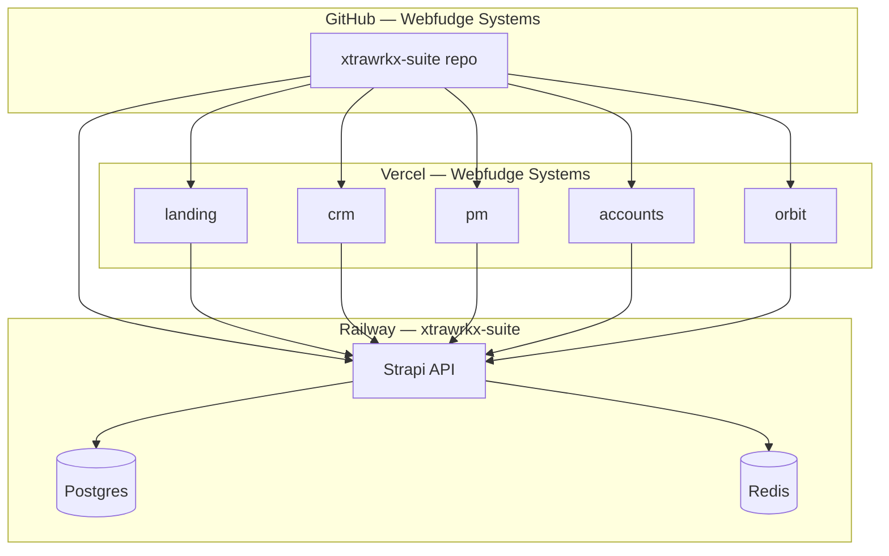
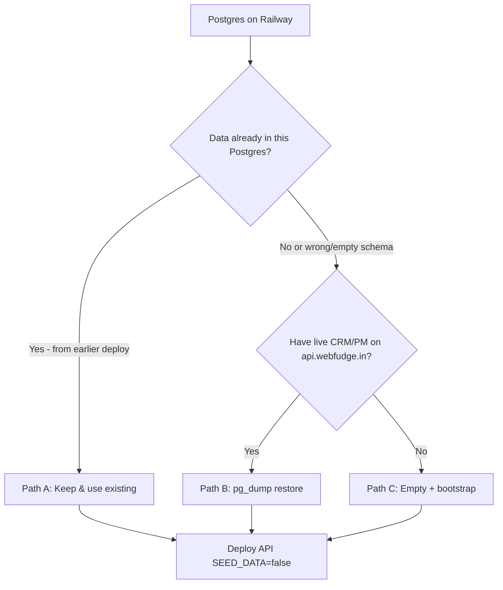

# Webfudge Systems — Complete Deployment Guide (From Scratch)

## Summary

End-to-end checklist for deploying the **Xtrawrkx Suite monorepo** using:

| Platform | Account / resource | Role |
|----------|-------------------|------|
| **GitHub** | Organization: **Webfudge Systems** | New canonical repo (monorepo source) |
| **Railway** | Existing project **`xtrawrkx-suite`** | Strapi API, Postgres, Redis |
| **Vercel** | Team: **Webfudge Systems** | All Next.js frontends |

This guide assumes you are **not** reusing old personal-repo Vercel/Railway Git links. You reconnect the **existing Railway** project to the **new org repo**, create **new Vercel projects**, and choose how to handle **Postgres data** (keep Railway DB, import from legacy `api.webfudge.in`, or start empty).

---

## What you are deploying

| App | Path | Port (dev) | Host |
|-----|------|------------|------|
| Landing (marketing) | `apps/landing` | 3000 | Vercel |
| CRM | `apps/crm` | 3001 | Vercel |
| Client portal | `apps/xtrawrkx-client-portal` | 3002 | Vercel (optional) |
| Accounts | `apps/accounts` | 3003 | Vercel |
| Orbit (org manager) | `apps/organization-manager` | 3004 | Vercel |
| PM | `apps/pm` | 3005 | Vercel |
| Books | `apps/books` | 3008 | Vercel (optional) |
| **Strapi API** | `apps/backend` | 1337 | **Railway** |

Shared packages: `packages/auth`, `packages/ui`, `packages/utils`, `packages/config`.

---

## Target architecture



---

## Domain strategy (pick one before Vercel env vars)

You must use **one consistent API + app URL set** in Railway, Vercel, and `apps/backend/config/middlewares.js`.

### Option A — Legacy production (`*.webfudge.in`)

Matches current `apps/*/.env.production` and live CRM/PM today.

| Service | URL |
|---------|-----|
| API | `https://api.webfudge.in` |
| CRM | `https://crm.webfudge.in` |
| PM | `https://pm.webfudge.in` |
| Accounts | `https://accounts.webfudge.in` |
| Landing | `https://xtrawrkx.com` or your marketing domain |

**CORS:** Add `https://crm.webfudge.in`, `https://pm.webfudge.in`, `https://accounts.webfudge.in`, `https://api.webfudge.in` to `allowedOrigins` in `apps/backend/config/middlewares.js` and redeploy API.

### Option B — Xtrawrkx subdomains (`*.xtrawrkx.com`) — already in CORS

| Service | URL |
|---------|-----|
| API | `https://api.xtrawrkx.com` |
| CRM | `https://crm.xtrawrkx.com` |
| PM | `https://pm.xtrawrkx.com` |
| Accounts | `https://accounts.xtrawrkx.com` |
| Orbit | `https://orbit.xtrawrkx.com` |
| Landing | `https://xtrawrkx.com` |

Use this table’s URLs in all **Vercel `NEXT_PUBLIC_*`** variables below (replace `<API>` / `<CRM>` etc. with your chosen option).

Until DNS is live, use Railway (`*.up.railway.app`) and Vercel (`*.vercel.app`) URLs temporarily — CORS allows `https://*.vercel.app`.

---

## Master checklist (order matters)

| # | Phase | Done |
|---|--------|------|
| 1 | [GitHub — new org repo](#phase-1--github-webfudge-systems) | ☐ |
| 2 | [Railway — reconnect repo & configure API](#phase-2--railway-existing-xtrawrkx-suite) | ☐ |
| 3 | [Postgres — choose data path](#phase-3--postgresql-data-strategy) | ☐ |
| 4 | [Redis — add & link](#phase-4--redis) | ☐ |
| 5 | [Backend — deploy & verify](#phase-5--deploy-backend) | ☐ |
| 6 | [Vercel — new projects](#phase-6--vercel-webfudge-systems) | ☐ |
| 7 | [DNS & custom domains](#phase-7--dns-and-custom-domains) | ☐ |
| 8 | [Smoke tests](#phase-8--verification) | ☐ |

---

## Phase 1 — GitHub (Webfudge Systems)

### 1.1 Create the repository

1. Log in to GitHub as a member of **Webfudge Systems**.
2. **New repository** (e.g. `xtrawrkx-suite` or `xtrawrkx-suits`).
3. Settings:
   - **Private** (recommended)
   - **Do not** add README/license/gitignore if pushing existing monorepo (avoid merge conflicts)
   - Default branch: **`main`** or **`master`** (pick one; use the same everywhere)

### 1.2 Push local monorepo

From your machine (repo root):

```bash
# Ensure everything is committed (including apps/landing)
git status
git add -A
git commit -m "chore: prepare monorepo for Webfudge Systems deploy"

# Add new org remote (keep old remote as backup if needed)
git remote rename origin old-origin   # optional
git remote add origin https://github.com/<webfudge-systems-org>/<repo-name>.git

# Push default branch
git push -u origin master
# or: git push -u origin main
```

### 1.3 Branch for production

| Host | Recommended branch |
|------|-------------------|
| Railway | `master` or `main` |
| Vercel | Same as Railway |

Document the branch name in Railway/Vercel so the team does not deploy the wrong branch.

### 1.4 Repo hygiene before push

- **Never commit** `.env`, `.env.local`, secrets, or `apps/backend/.tmp/`
- Confirm `.gitignore` covers SQLite dev DB and uploads you do not want in git
- Optional: enable branch protection on `main`/`master` (PR required)

---

## Phase 2 — Railway (existing `xtrawrkx-suite`)

You already have a Railway project with **Postgres** and service **`xtrawrkx_suits`**. Re-point it to the **new GitHub org repo**.

### 2.1 Connect GitHub

1. Railway → **Account Settings** → link **Webfudge Systems** GitHub (org access).
2. Open project **`xtrawrkx-suite`** → service **`xtrawrkx_suits`** (API).
3. **Settings → Source**:
   - **Connect repo:** `Webfudge Systems/<repo-name>`
   - **Branch:** `master` or `main`
   - **Root Directory:** `apps/backend` ← **critical for monorepo**
4. Disconnect old personal-repo link if it still points elsewhere.

### 2.2 Build & start commands

| Setting | Value |
|---------|--------|
| **Root Directory** | `apps/backend` |
| **Build Command** | `npm install` or `npm ci` |
| **Start Command** | `npm run start` |
| **Watch Paths** (optional) | `apps/backend/**` |

Node **20.x** (see `apps/backend/package.json` engines).

### 2.3 Link Postgres to API

API service → **Variables**:

```bash
DATABASE_CLIENT=postgres
DATABASE_URL=${{Postgres.DATABASE_PRIVATE_URL}}
DATABASE_SSL=true
DATABASE_SSL_REJECT_UNAUTHORIZED=false
DATABASE_POOL_MIN=0
DATABASE_POOL_MAX=5
```

Prefer **`DATABASE_PRIVATE_URL`** when API and Postgres are in the same Railway project.

### 2.4 Required Strapi secrets (API service)

Generate locally (one value per variable):

```bash
node -e "console.log(require('crypto').randomBytes(32).toString('base64'))"
```

| Variable | Notes |
|----------|--------|
| `NODE_ENV` | `production` |
| `HOST` | `0.0.0.0` |
| `PORT` | `${{PORT}}` |
| `SEED_DATA` | **`false`** in production |
| `APP_KEYS` | 4 comma-separated keys |
| `ADMIN_JWT_SECRET` | |
| `API_TOKEN_SALT` | |
| `TRANSFER_TOKEN_SALT` | |
| `JWT_SECRET` | |
| `ENCRYPTION_KEY` | |
| `PUBLIC_URL` | `https://<API>` (your API domain) |

**If importing legacy DB (Path B below):** copy `APP_KEYS`, `JWT_SECRET`, `ADMIN_JWT_SECRET`, `API_TOKEN_SALT`, `TRANSFER_TOKEN_SALT`, `ENCRYPTION_KEY` from the **old** `api.webfudge.in` Railway/host env so existing password hashes work and sessions behave predictably.

**If new secrets on restored DB:** users must log in again (passwords in DB still valid).

### 2.5 Do not copy local dev `.env`

Local uses **SQLite** and often `SEED_DATA=true`. Production must use **Postgres** + **`SEED_DATA=false`**.

More detail: [RAILWAY_STRAPI_DEPLOY.md](./RAILWAY_STRAPI_DEPLOY.md).

---

## Phase 3 — PostgreSQL data strategy

Choose **one** path before the first successful production boot.



### Path A — Keep existing Railway Postgres data

**Use when:** This Postgres already has Strapi tables and CRM/PM data from a previous deploy to the same Railway project.

1. **Do not** run `pg_restore` or wipe the volume.
2. Set API env (Phase 2) with **same Strapi secrets** as when that data was created (if unknown, users re-login after new JWT secrets).
3. Deploy API with `SEED_DATA=false`.
4. Verify in [Phase 5](#phase-5--deploy-backend).

**Risk:** Schema from an **old** Strapi version may not match current `apps/backend` — watch deploy logs for migration errors.

---

### Path B — Import from legacy production (`api.webfudge.in`)

**Use when:** Live CRM/PM data is on the **old** stack and Railway Postgres is empty or should be replaced.

#### B.1 What to copy

| Asset | Contents |
|-------|----------|
| **Postgres dump** | Orgs, users, roles, leads, contacts, deals, tasks, projects, meetings, proposals, invoices, … |
| **Uploads** | `public/uploads` from old Strapi host |
| **Strapi secrets** (recommended) | Same `APP_KEYS` / `JWT_*` as old API |

#### B.2 Backup old database

From a machine with network access to **old** Postgres (old Railway project, Supabase, etc.):

```bash
# Recommended: custom format
pg_dump "$OLD_DATABASE_URL" \
  --format=custom \
  --no-owner \
  --no-acl \
  --file=webfudge-crm-pm-$(date +%Y%m%d).dump
```

Store securely (PII).

**Find `OLD_DATABASE_URL`:** old Railway Postgres → **Connect** → `DATABASE_URL` or `DATABASE_PRIVATE_URL`.

#### B.3 Prepare Railway Postgres

1. **Stop or scale API to 0** (no Strapi writes during restore).
2. Railway → **Postgres** → **Connect** → copy URL → `NEW_DATABASE_URL`.

#### B.4 Restore

```bash
pg_restore --clean --if-exists --no-owner --no-acl \
  -d "$NEW_DATABASE_URL" \
  webfudge-crm-pm-YYYYMMDD.dump
```

If errors on roles/extensions, retry with plain SQL dump:

```bash
pg_dump "$OLD_DATABASE_URL" --clean --if-exists -f backup.sql
psql "$NEW_DATABASE_URL" -f backup.sql
```

#### B.5 Uploads

Strapi default provider stores files under `apps/backend/public/uploads`.

- Copy folder from old server into Railway **volume** mounted at `public/uploads`, or
- Use Railway persistent volume + one-off copy job.

Missing uploads = broken images in CRM/PM, not missing rows in Postgres.

#### B.6 Deploy API

- `SEED_DATA=false`
- Deploy; watch logs for Strapi schema sync
- **Do not** set `SEED_DATA=true` after restore

#### B.7 Verify data

```bash
curl -s https://<API>/api/apps
```

Strapi Admin → Organizations, Users, sample Lead Company / Task.

---

### Path C — Empty database (greenfield)

**Use when:** No legacy data to preserve.

1. Fresh Railway Postgres (or wipe only if you accept data loss).
2. API env: new Strapi secrets, `SEED_DATA=false`.
3. On first boot, bootstrap seeds **apps/modules** only when no `App` rows exist (see `apps/backend/database/seeds/`).
4. Create org/users via Orbit or Strapi Admin — not the same as full CRM/PM import.

Dev-only wipe: [LOCAL_DB_RESET.md](./LOCAL_DB_RESET.md) (SQLite, not production).

---

### Path comparison

| Path | Postgres | Uploads | Users |
|------|----------|---------|-------|
| A Keep | Existing Railway | Keep on volume if any | Existing |
| B Import | Replace with dump | Copy from old API | From dump |
| C Empty | New | None | Manual / seed |

---

## Phase 4 — Redis

CRM/PM list caching — strongly recommended in production.

1. Railway project → **+ New** → **Redis**.
2. Link to **API** service → Variables:

```bash
REDIS_URL=${{Redis.REDIS_URL}}
```

Use private URL (`redis.railway.internal`) inside Railway.

3. Optional:

```bash
CACHE_API_ENABLED=true
CACHE_TTL_SECONDS=300
```

4. Redeploy API → logs: `✅ Redis connected`.

Verify:

```bash
curl -s https://<API>/api/health/redis
```

Detail: [REDIS_CACHE.md](./REDIS_CACHE.md).

---

## Phase 5 — Deploy backend

### 5.1 Trigger deploy

- Push to `master`/`main` on org repo, or
- Railway → **Deploy** → **Redeploy**

### 5.2 Logs (success)

Look for:

- `strapi start` without `KnexTimeoutError`
- Postgres connected
- `Redis connected` (if configured)
- No crash loop from `SEED_DATA=true`

### 5.3 HTTP checks

```bash
curl -s https://<railway-api-url>/api/apps
curl -s https://<railway-api-url>/api/health/redis
```

Admin panel: `https://<API>/admin`

### 5.4 Custom domain (API)

Railway API service → **Networking** → add `api.webfudge.in` or `api.xtrawrkx.com` → DNS CNAME per Railway instructions.

Update `PUBLIC_URL` to match.

### 5.5 Troubleshooting

| Symptom | Fix |
|---------|-----|
| `KnexTimeoutError` | `DATABASE_CLIENT=postgres`, linked `DATABASE_URL`, SSL on — [RAILWAY_STRAPI_DEPLOY.md](./RAILWAY_STRAPI_DEPLOY.md) |
| Wrong code deployed | Root directory must be `apps/backend` |
| Empty CRM after “success” | Wrong Postgres path — use Path B or check Path A |
| CORS errors later | Phase 7 + `middlewares.js` |

---

## Phase 6 — Vercel (Webfudge Systems)

Create **new projects** under the **Webfudge Systems** Vercel team. Do not reuse old personal-team projects tied to the previous repo.

### 6.1 Team & GitHub

1. Vercel → switch team to **Webfudge Systems**.
2. **Settings → Git** → connect **Webfudge Systems** GitHub org.
3. Import monorepo repo (same as Railway).

### 6.2 Monorepo settings (every Next app)

Create **one Vercel project per app**:

| Setting | Value |
|---------|--------|
| Framework | Next.js |
| **Root Directory** | See table below |
| **Include files outside root** | **Enabled** |
| Node.js | 20.x |
| **Install Command** | `cd ../.. && npm ci` |
| **Build Command** | `npm run build` |
| Production branch | `master` or `main` |

`vercel.json` in `apps/landing` and `apps/organization-manager` already sets install from repo root.

### 6.3 Vercel project map

| Vercel project (suggested) | Root directory | Domain (example) |
|---------------------------|----------------|------------------|
| `webfudge-landing` | `apps/landing` | `xtrawrkx.com` |
| `webfudge-crm` | `apps/crm` | `<CRM>` |
| `webfudge-pm` | `apps/pm` | `<PM>` |
| `webfudge-accounts` | `apps/accounts` | `<ACCOUNTS>` |
| `webfudge-orbit` | `apps/organization-manager` | `<ORBIT>` |
| `webfudge-portal` (optional) | `apps/xtrawrkx-client-portal` | `<PORTAL>` |

Replace `<CRM>` etc. with URLs from [Domain strategy](#domain-strategy-pick-one-before-vercel-env-vars).

### 6.4 Environment variables (Production)

Set per project → **Environment Variables** → **Production**.  
**Redeploy** after changes (`NEXT_PUBLIC_*` is baked in at build time).

Use **`<API>`** = your live API URL (Railway default or custom), no trailing path for CRM/PM/Accounts (auth package appends `/api/...`).

#### Landing — `apps/landing`

```bash
NEXT_PUBLIC_BASE_URL=https://xtrawrkx.com
NEXT_PUBLIC_STRAPI_API_URL=<API>/api
NEXT_PUBLIC_API_URL=<API>
NEXT_PUBLIC_CRM_PORTAL_URL=<CRM>
NEXT_PUBLIC_CLIENT_PORTAL_URL=<PORTAL>
# Cloudinary, Firebase, EMAIL_USER, EMAIL_PASS — see apps/landing/.env.example
```

#### CRM — `apps/crm`

```bash
NEXT_PUBLIC_API_URL=<API>
NEXT_PUBLIC_CRM_APP_URL=<CRM>
NEXT_PUBLIC_PM_APP_URL=<PM>
```

#### PM — `apps/pm`

```bash
NEXT_PUBLIC_API_URL=<API>
NEXT_PUBLIC_PM_APP_URL=<PM>
NEXT_PUBLIC_CRM_APP_URL=<CRM>
```

#### Accounts — `apps/accounts`

```bash
NEXT_PUBLIC_API_URL=<API>
NEXT_PUBLIC_ACCOUNTS_APP_URL=<ACCOUNTS>
NEXT_PUBLIC_CRM_ORIGIN=<CRM>
```

#### Orbit — `apps/organization-manager`

```bash
NEXT_PUBLIC_API_URL=<API>
NEXT_PUBLIC_ORG_MANAGER_URL=<ORBIT>
NEXT_PUBLIC_SITE_URL=<ORBIT>
NEXT_PUBLIC_ACCOUNTS_APP_URL=<ACCOUNTS>
NEXT_PUBLIC_PM_APP_URL=<PM>
NEXT_PUBLIC_CRM_APP_URL=<CRM>
```

### 6.5 First deploy tips

- Deploy **API first** (Railway), confirm `/api/apps`, then deploy Vercel apps.
- First Vercel build may take several minutes (`npm ci` at monorepo root).
- If build fails on lockfile: set `NEXT_IGNORE_INCORRECT_LOCKFILE=1` (see `vercel.json` examples).

### 6.6 Local build sanity check

```bash
npm install
npm run build:landing
npm run build:crm
npm run build:pm
npm run build:accounts
npm run build:org-manager
```

---

## Phase 7 — DNS and custom domains

### 7.1 Railway (API)

| Record | Points to |
|--------|-----------|
| `api.webfudge.in` or `api.xtrawrkx.com` | Railway CNAME target |

### 7.2 Vercel (frontends)

Per project → **Domains** → add hostname → follow Vercel DNS (CNAME / A).

### 7.3 CORS (`apps/backend/config/middlewares.js`)

Ensure **every** production frontend origin is listed in `allowedOrigins`, for example:

```javascript
'https://crm.webfudge.in',
'https://pm.webfudge.in',
'https://accounts.webfudge.in',
'https://xtrawrkx.com',
'https://www.xtrawrkx.com',
```

Patterns already allow `https://*.vercel.app` and `https://*.xtrawrkx.com`.

Commit CORS changes → push → Railway redeploys API.

Detail: [BACKEND_CORS_ORG_HEADER_UPDATE.md](./BACKEND_CORS_ORG_HEADER_UPDATE.md).

---

## Phase 8 — Verification

### Backend

| Check | Expected |
|-------|----------|
| `GET /api/apps` | JSON list of apps |
| `GET /api/health/redis` | `configured: true`, ping OK |
| Strapi Admin | Loads; data visible (Path A/B) |
| Postgres metrics | Stable connections, no pool exhaustion |

### CRM

| Check | Expected |
|-------|----------|
| Login | User from DB (Path A/B) |
| Org picker | Sets `X-Organization-Id` |
| Leads / contacts | Data visible |
| Repeat list request | `X-Cache: HIT` (if Redis on) |

### PM

| Check | Expected |
|-------|----------|
| Projects / tasks | Data matches pre-migration |
| No console CORS errors | |

### Accounts & Orbit

| Check | Expected |
|-------|----------|
| Users / roles | Admin can list users |
| Orbit platform login | `admin@xtrawrkx.com` if seeded/restored |

### Landing

| Check | Expected |
|-------|----------|
| Home / contact | Loads |
| Contact form | Email route configured |

---

## Quick reference — where things live

| Item | Location |
|------|----------|
| Monorepo | `github.com/<webfudge-systems-org>/<repo>` |
| Railway project | `xtrawrkx-suite` |
| API service | `xtrawrkx_suits`, root `apps/backend` |
| Vercel team | Webfudge Systems |
| Legacy data source | `api.webfudge.in` Postgres + uploads |
| Env templates | `apps/*/.env.example`, `apps/backend/.env.example` |

---

## Related docs

| Doc | Topic |
|-----|--------|
| [RAILWAY_STRAPI_DEPLOY.md](./RAILWAY_STRAPI_DEPLOY.md) | Postgres SSL, pool, crash fixes |
| [REDIS_CACHE.md](./REDIS_CACHE.md) | API cache behavior |
| [ACCOUNTS_PRODUCTION_DEPLOY.md](./ACCOUNTS_PRODUCTION_DEPLOY.md) | Accounts-specific notes |
| [LANDING_MONOREPO_UPDATE.md](./LANDING_MONOREPO_UPDATE.md) | Landing app in monorepo |
| [LANDING_CONTACT_FORM.md](./LANDING_CONTACT_FORM.md) | Contact email env |
| [ENVIRONMENT.md](./ENVIRONMENT.md) | Full env var reference |
| [XTRAWRKX_PRODUCTION_DEPLOYMENT_GUIDE.md](./XTRAWRKX_PRODUCTION_DEPLOYMENT_GUIDE.md) | Earlier xtrawrkx.com–focused checklist |

---

## Appendix — Postgres CLI on Windows

Install [PostgreSQL client tools](https://www.postgresql.org/download/windows/) or use Railway’s **Connect** in-browser query, or WSL:

```powershell
# Example with Railway public URL (for restore from your PC)
$env:PGPASSWORD = "<password>"
pg_restore -h <host> -p <port> -U postgres -d railway --clean --if-exists --no-owner --no-acl .\backup.dump
```

Use **public** Postgres URL from Railway when running tools on your laptop; use **private** URL only inside Railway services.
