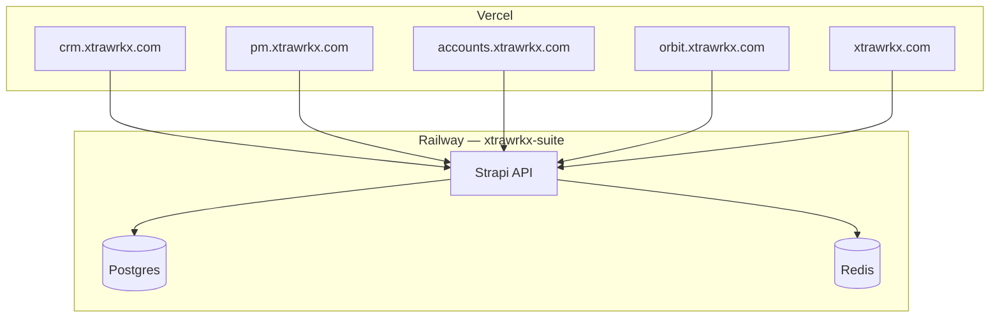

# Xtrawrkx Suite — Production Deployment (Quick Reference)

> **From-scratch deploy (new GitHub org + Webfudge Systems Vercel + existing Railway):**  
> Use **[WEBFUDGE_SYSTEMS_DEPLOYMENT_GUIDE.md](./WEBFUDGE_SYSTEMS_DEPLOYMENT_GUIDE.md)** — full checklist with Postgres paths A/B/C, org repo setup, and Vercel project map.

This file keeps the **xtrawrkx.com** domain layout and technical details for Railway/Redis/migration. For Webfudge Systems onboarding, start with the guide above.

---

## Summary

Deploy the full suite:

1. **Railway** — `apps/backend`, Postgres, Redis  
2. **Postgres** — keep Railway data, import from `api.webfudge.in`, or empty  
3. **Vercel** — CRM, PM, Accounts, Orbit, Landing  

---

## Target architecture

| Layer | Path |
|-------|------|
| API | `apps/backend` |
| CRM / PM / Accounts / Orbit / Landing | `apps/crm`, `apps/pm`, … |

Domains: `*.xtrawrkx.com` (see `apps/backend/config/middlewares.js`).

---

## Order of operations

| Step | Action |
|------|--------|
| 0 | Code on deploy branch (`master`/`main`) — [Webfudge Systems guide](./WEBFUDGE_SYSTEMS_DEPLOYMENT_GUIDE.md#phase-1--github-webfudge-systems) |
| 1 | Railway API + Postgres |
| 2 | Redis linked to API |
| 3 | Postgres Path A, B, or C — [data strategy](./WEBFUDGE_SYSTEMS_DEPLOYMENT_GUIDE.md#phase-3--postgresql-data-strategy) |
| 4 | API domain + `/api/apps` |
| 5 | Vercel projects + `NEXT_PUBLIC_*` |
| 6 | DNS + smoke tests |

---

## Railway API (essentials)

| Setting | Value |
|---------|--------|
| Root Directory | `apps/backend` |
| `DATABASE_URL` | `${{Postgres.DATABASE_PRIVATE_URL}}` |
| `DATABASE_CLIENT` | `postgres` |
| `SEED_DATA` | `false` |

Full variable list: [WEBFUDGE_SYSTEMS_DEPLOYMENT_GUIDE.md § Phase 2](./WEBFUDGE_SYSTEMS_DEPLOYMENT_GUIDE.md#phase-2--railway-existing-xtrawrkx-suite).

Troubleshooting: [RAILWAY_STRAPI_DEPLOY.md](./RAILWAY_STRAPI_DEPLOY.md).

---

## Redis

Link Redis → API → `REDIS_URL`. Verify: `GET /api/health/redis`.  
[REDIS_CACHE.md](./REDIS_CACHE.md)

---

## Postgres migration (legacy)

Import from `api.webfudge.in`: `pg_dump` → `pg_restore` → copy `public/uploads`.  
Details: [WEBFUDGE_SYSTEMS_DEPLOYMENT_GUIDE.md § Path B](./WEBFUDGE_SYSTEMS_DEPLOYMENT_GUIDE.md#path-b--import-from-legacy-production-apiwebfudgein).

---

## Vercel monorepo

| Project | Root |
|---------|------|
| CRM | `apps/crm` |
| PM | `apps/pm` |
| Accounts | `apps/accounts` |
| Orbit | `apps/organization-manager` |
| Landing | `apps/landing` |

Install: `cd ../.. && npm ci` · Build: `npm run build`

Env vars: [WEBFUDGE_SYSTEMS_DEPLOYMENT_GUIDE.md § 6.4](./WEBFUDGE_SYSTEMS_DEPLOYMENT_GUIDE.md#64-environment-variables-production).

---

## Related docs

- **[WEBFUDGE_SYSTEMS_DEPLOYMENT_GUIDE.md](./WEBFUDGE_SYSTEMS_DEPLOYMENT_GUIDE.md)** — primary from-scratch guide  
- [ACCOUNTS_PRODUCTION_DEPLOY.md](./ACCOUNTS_PRODUCTION_DEPLOY.md)  
- [LANDING_MONOREPO_UPDATE.md](./LANDING_MONOREPO_UPDATE.md)  
- [ENVIRONMENT.md](./ENVIRONMENT.md)
